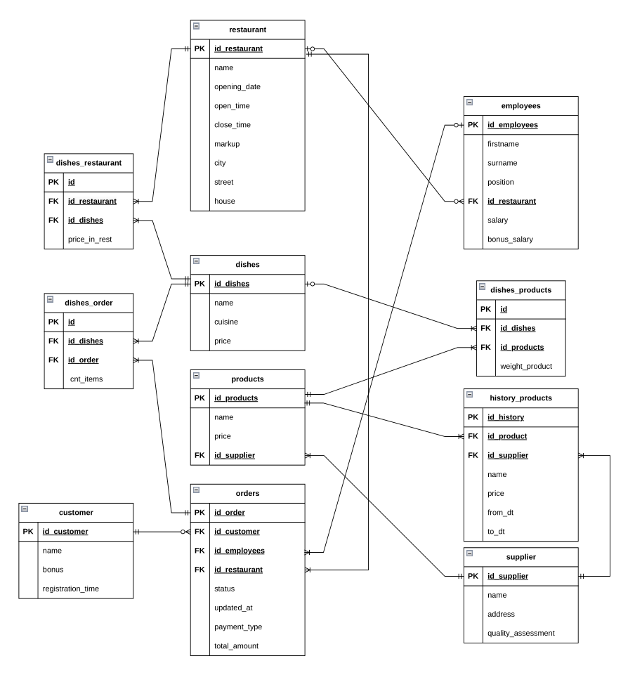
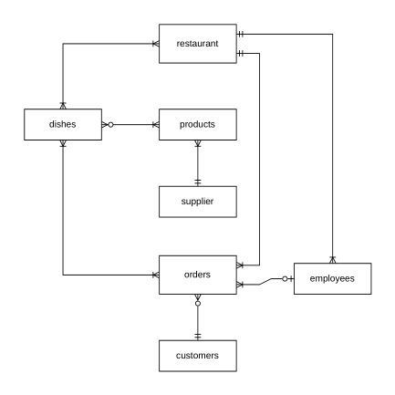

# Рестораны города N

## О проекте

### Легенда
Жители города N очень привередливы в выборе мест, где перекусить. У многих из них есть аллергия на некотрые продукты и они хотят посещать рестораны, где нет блюд с аллергенами, у других любовь к азиатской кухне. Все эти запросы клиентов можно решить с помощью грамотной организации базы данных _MyRest_.

База данных спроектирована в **3НФ** с использованием **SCD 4** для версионирования данных о продуктах.

## Физическая модель

### Диаграммы

<b>Физическая диаграмма</b>

[Физическая диаграмма](./docs/physical_diagram.md)
(_находится в md_)

<b>Логическая диаграмма</b>

<b>Концептуальная диаграмма</b>

### Ключевые сущности:
1. **Рестораны** - информация о заведениях, их графике работы и наценке
2. **Блюда** - меню ресторанов с указанием кухни
3. **Продукты** - ингредиенты для блюд с историей изменения цен
4. **Поставщики** - компании, поставляющие продукты
5. **Посетители** - клиенты ресторанов с их бонусами
6. **Сотрудники** - персонал ресторанов

## Проверка работы
1. Рестораны и их длительность работы
2. Рестораны с блюдами без лука
3. Сотрудники в ресторане "Суши Мастер"
4. Цена и поставщик продукта в 2021 году
5. Ресторан с максимальной зарплатой у официанта
6. Клиенты и заказы в статусе 'new'
7. Добавление нового заказа
8. Топ 3 самых качественных продукта
9. Кухня с самым дорогим блюдом
10. Топ 3 самых дорогих блюд в каждом ресторане
11. Рестораны с Итальянской кухней

Запросы можно найти в папке `./scripts`, а результаты [тут](./scripts/answer.md)

